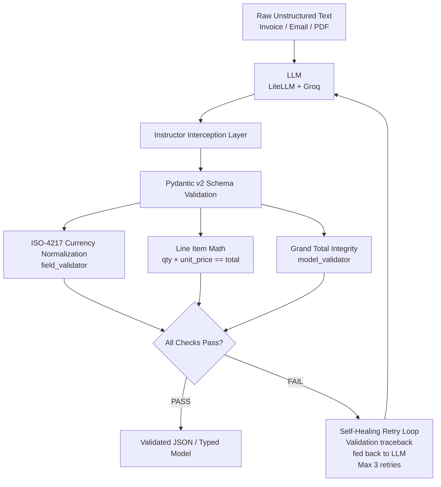

# Deterministic Extraction Engine

An enterprise-grade data extraction service that enforces strict schemas, cross-field arithmetic validation, and automated error-recovery on unstructured business text using **Pydantic v2**, **Instructor**, and **LiteLLM**.

[](https://www.python.org/downloads/)
[](https://docs.pydantic.dev/)
[](https://opensource.org/licenses/MIT)

## Table of Contents

- [The Problem](#the-problem)
- [Architecture & Defense Layers](#architecture--defense-layers)
- [Features](#features)
- [Project Structure](#project-structure)
- [Getting Started](#getting-started)
- [Usage](#usage)
- [Verification & Test Suite](#verification--test-suite)
- [How the Self-Healing Loop Works](#how-the-self-healing-loop-works)
- [License](#license)

---

## The Problem

Large Language Models are probabilistic text generators. When integrated into accounting, ERP, or inventory backends, hallucinated keys, markdown formatting, or subtle mathematical contradictions silently corrupt transactional records.

Traditional mitigation strategies — prompt engineering, temperature tuning, "please return valid JSON" — reduce the failure rate but do not eliminate it. In financial systems, "mostly correct" is not a passing grade.

This engine treats LLM output as **untrusted input** and subjects it to the same rigor as any external data source: strict schemas, type contracts, and mathematical invariants that must hold before a record is persisted.

## Architecture & Defense Layers

The pipeline wraps the LLM in a **deterministic enforcement layer**. Invalid output is never returned — it is either healed or rejected.



Each defense layer has a distinct responsibility:

| Layer | Responsibility | Failure Mode Prevented |
| :--- | :--- | :--- |
| **Pydantic v2 Schema** | Type contracts (str, int, date) | Missing keys, wrong types |
| **`@field_validator`** | Per-field normalization (ISO-4217 currency) | "dollars", "USD ", "usd" → `USD` |
| **`@model_validator` (line items)** | qty × unit_price == line total | Vendor arithmetic errors |
| **`@model_validator` (grand total)** | Sum of line items == invoice total | Contradictory vendor totals |
| **Instructor + Retry Loop** | Feed validation error back to LLM | Silent acceptance of bad output |

## Features

- **Deterministic Type Contracts** — Enforces strict ISO dates, standard 3-letter currency codes, and positive quantities.
- **Cross-Field Mathematical Integrity** — Catches discrepancies between vendor-stated totals and actual line-item calculations.
- **Automated Healing** — Feeds Pydantic validation tracebacks directly back to the model context window to force correction before returning.
- **Multi-Model Abstraction** — Operates through LiteLLM for zero-downtime provider fallback routing.
- **Fail-Closed by Default** — If validation cannot be satisfied within the retry budget, the pipeline raises rather than returning a partial record.

## Project Structure

```
.
├── extractor.py         # LLM invocation, Instructor patching, retry orchestration
├── schema.py            # Pydantic v2 models: Invoice, LineItem, validators
├── test_extractor.py    # Test harness: happy path, contradictory math, non-commercial
├── .gitignore
└── README.md
```

## Getting Started

### 1. Prerequisites

- Python 3.11+
- An API key for a supported provider (Groq, OpenAI, Gemini, etc.)

### 2. Install

```bash
git clone https://github.com/0xAnthonyRx/deterministic-engine.git
cd deterministic-engine
python3 -m venv venv
source venv/bin/activate
pip install pydantic instructor litellm pytest python-dotenv
```

### 3. Configure

Create a `.env` file in the project root:

```ini
GROQ_API_KEY="your-groq-api-key-here"
# Or any LiteLLM-supported provider:
# OPENAI_API_KEY="..."
# GEMINI_API_KEY="..."
```

## Usage

Extract a structured invoice from raw text. The engine returns a validated Pydantic object — never a raw string, never a partially-filled dict.

```python
from extractor import extract_invoice

raw_email = """
Hi, please process the following order:
- 12 × Widget A @ 150.00 = 1,800.00
- 4  × Widget B @ 275.00 = 1,100.00
Subtotal: 2,900.00 GHS
"""

invoice = extract_invoice(raw_email)

print(invoice.total_amount)      # Decimal('2900.00')
print(invoice.currency)          # 'GHS'
print(invoice.line_items[0].sku) # 'Widget A'
```

If the vendor's stated subtotal contradicts the line-item sum, the engine does **not** silently accept the mismatch. It raises a validation error, feeds the exact traceback back to the LLM, and retries up to three times before failing loudly.

## Verification & Test Suite

The pipeline includes an automated test harness covering standard multi-item invoices, contradictory vendor calculations, and non-commercial inputs.

```bash
# Run the test suite
pytest -v
```

Expected output:

```text
test_extractor.py::test_standard_invoice_extraction PASSED      [ 33%]
test_extractor.py::test_contradictory_math_self_heals PASSED     [ 66%]
test_extractor.py::test_non_transactional_text_handling PASSED   [100%]
============================== 3 passed in 17.64s ==============================
```

The test cases are deliberately adversarial:

| Test | What It Proves |
| :--- | :--- |
| `test_standard_invoice_extraction` | Happy path — well-formed invoices extract cleanly. |
| `test_contradictory_math_self_heals` | Vendor states a total that contradicts line items → engine detects, retries, and self-heals. |
| `test_non_transactional_text_handling` | Non-commercial input (e.g., a chit-chat email) is rejected rather than hallucinated into a fake invoice. |

## How the Self-Healing Loop Works

The most interesting part of the engine is what happens when validation fails.

```text
1. LLM returns a candidate JSON payload.
2. Instructor parses it into a Pydantic model.
3. A `@model_validator` detects that `sum(line_items) != total_amount`.
4. Pydantic raises a `ValidationError` with a structured traceback.
5. Instructor catches the error and re-invokes the LLM, appending the
   traceback to the conversation as a user message.
6. The LLM sees the specific contradiction and returns a corrected payload.
7. Steps 2–6 repeat until validation passes or the retry budget (3) is exhausted.
8. If the budget is exhausted, the pipeline raises — it never returns
   a partially-valid record to the caller.
```

This is what makes the engine "deterministic" in practice: the *LLM* is stochastic, but the *interface contract* is not. Callers know that if `extract_invoice()` returns a value, every mathematical invariant held.

## License

MIT
